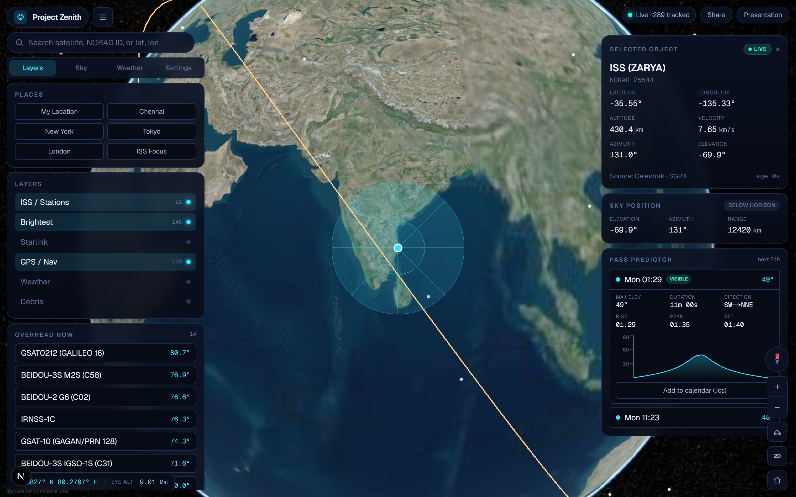
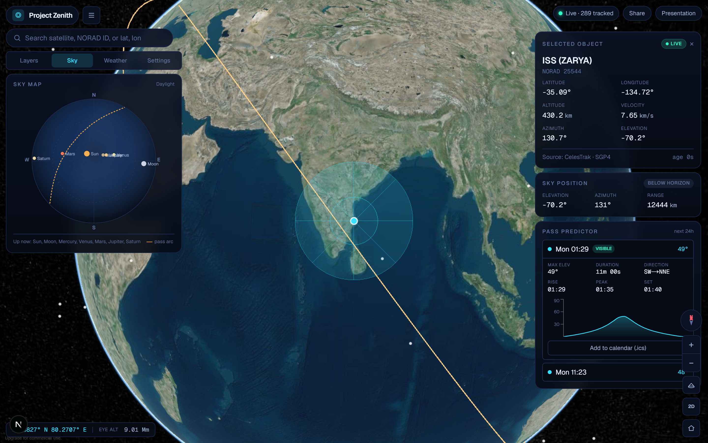
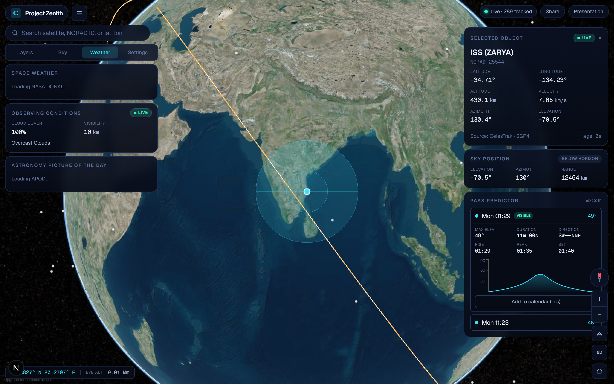
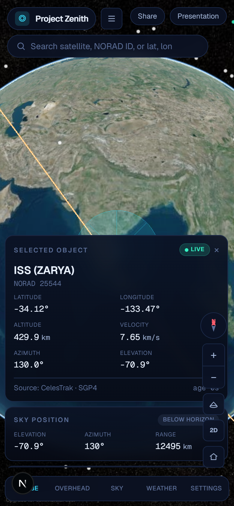

# 🛰️ Project Zenith — The Celestial Eye

> **Turn any point on Earth into a live observatory.**

A real-time celestial intelligence dashboard. Drop a pin anywhere on the globe and instantly see the satellites, the ISS, planets, and sky conditions currently overhead — presented like a mission-control instrument: scientifically credible, fast, and responsive across desktop, tablet, and mobile.

Built for **AstralWeb Innovate — Round 2** (AARUUSH '26, SRM Institute of Science and Technology) by **Team IDSCC**.

- **🔭 Live URL:** **https://project-zenith-alpha.vercel.app**
- **Repository:** https://github.com/NoumanS-20/project-zenith

## 📸 Screenshots


_Full-bleed 3D globe with the zenith cone, ISS orbit trail, live overhead list, telemetry, and pass predictor._

| Sky Map | Space Weather | Mobile |
|---|---|---|
|  |  |  |

---

## ✨ Features

**Core**
- 🌍 Full-screen interactive **3D globe** (CesiumJS) with a 2D map fallback for low-power devices
- 📍 **Click-to-pick** any coordinate, or enter latitude/longitude manually, or use presets
- 🛰️ **Overhead-now** list of objects above the selected location, ranked by zenith-closeness
- 🔭 **ISS live tracking** + selected-satellite telemetry (position, altitude, velocity, az/el, data age, source)
- 🌐 Category filters: ISS/stations, brightest, Starlink, GPS/navigation, weather, debris

**High-impact**
- 🔦 **Zenith Cone** — luminous overhead search radius from the selected coordinate
- 🛰️ **Orbit trails** & camera fly-to for any selected object
- 📈 **Pass Predictor** — next visible passes with elevation, duration, direction, quality
- 🧭 **Sky Map** — circular horizon view: planets, Moon, Sun/twilight, constellations, pass arc
- 🌡️ **Observation Score (0–100)** — blends cloud, darkness, moon, pass elevation, visibility
- ☀️ **Space-Weather Panel** — NASA DONKI flares/CMEs/storms with plain-English observing impact
- ⏳ **Time Machine** — scrub ±24h; positions, overhead list, and sky update with time
- 🎬 **Demo Mode & presets** — judge-friendly one-click locations and views
- 🔗 **Shareable observatory links** — `/observe?lat=..&lon=..&sat=..&time=now`
- 🩺 **Source Inspector** — live API status, cache age, update intervals, fallback state

> Every datum is labelled with its **source, freshness, and confidence** (live / predicted / cached / fallback).

---

## 🧱 Tech Stack

| Layer | Technology |
|-------|-----------|
| Framework | Next.js 16 (App Router) · React 19 · TypeScript (strict) |
| Styling | Tailwind CSS v4 (custom space-theme design tokens) |
| 3D Globe | CesiumJS + Resium |
| 2D Fallback | Leaflet / React-Leaflet |
| Orbital mechanics | satellite.js (SGP4/SDP4), run in a **Web Worker** |
| Astronomy | Astronomy Engine (Sun/Moon/planets/rise-set, client-side) |
| Data/state | TanStack Query (caching/polling) · Zustand (client state) |
| Validation | Zod (all external responses) |
| Charts | Recharts |
| Testing | Vitest (unit) · Playwright (E2E/responsive) |
| Deploy | Vercel |

---

## 🔌 Data Sources

All keyed providers are proxied **server-side** through Next.js route handlers — **API keys never reach the browser.**

| Source | Data | Auth | Role |
|--------|------|------|------|
| **CelesTrak** | TLE/GP orbital elements | none | Primary satellite data (cached 2h) |
| **Open-Notify** | ISS position + crew | none | Live ISS pin, people in space |
| **Astronomy Engine** | Sun/Moon/planets | none (client) | Sky map computation |
| **NASA DONKI** | Flares, CMEs, storms | key¹ | Space-weather panel |
| **NASA APOD** | Astronomy pic of the day | key¹ | Polish card |
| **NASA NeoWs** | Near-Earth objects | key¹ | NEO panel (optional) |
| **N2YO** | Visual pass predictions | key | Pass validation |
| **OpenWeatherMap** | Cloud cover, visibility | key | Observing conditions |
| **IP Geolocation** | Coarse location | key | Geolocation fallback |

¹ NASA falls back to the public `DEMO_KEY` if no key is set.

**Graceful degradation:** the core experience (globe, coordinate selection, overhead objects, ISS, orbital math) works with **zero API keys** — CelesTrak + Open-Notify + Astronomy Engine are keyless, and every provider falls back to cached/demo data with a clear UI status.

---

## 🚀 Local Setup

```bash
# 1. Install dependencies (also stages Cesium static assets into public/cesium)
npm install

# 2. (Optional) add API keys to unlock the keyed panels
cp .env.example .env.local   # then fill in values

# 3. Run the dev server
npm run dev                  # http://localhost:3000
```

### Environment variables

See [`.env.example`](.env.example). All are **optional** and **server-side only**:

| Var | Purpose |
|-----|---------|
| `NASA_API_KEY` | DONKI / APOD / NeoWs (else `DEMO_KEY`) |
| `N2YO_API_KEY` | Pass predictions |
| `OPENWEATHER_API_KEY` | Cloud cover / visibility |
| `IPGEO_API_KEY` | IP geolocation fallback |
| `SPACETRACK_USER` / `SPACETRACK_PASS` | Optional catalog metadata |
| `NEXT_PUBLIC_CESIUM_ION_TOKEN` | Optional nicer imagery (public by design) |

---

## 🧪 Testing & Quality

```bash
npm run typecheck    # tsc --noEmit (strict)
npm test             # Vitest unit tests (orbital math, scoring, normalization)
npm run e2e          # Playwright responsive E2E (1440 / 1024 / 390)
npm run build        # production build
```

---

## 🏗️ Architecture

```
Browser UI
  ├─ Zustand        selected location / object / filters / time
  ├─ TanStack Query caching + polling
  └─ Next.js API routes  (secure proxy — keys stay server-side)
        ├─ CelesTrak · Open-Notify · NASA · N2YO · OpenWeather
        ├─ Zod-validated → normalized typed data
        ├─ Web Worker: batch SGP4 propagation (satellite.js)
        ├─ Observer az/el + overhead/zenith filtering
        └─ Astronomy Engine: Sun/Moon/planets
  └─ Rendering: CesiumJS globe · Leaflet 2D · sky map · panels · status
```

See [`docs/ARCHITECTURE.md`](docs/ARCHITECTURE.md) for the full diagram and data flow.

---

## ⚡ Performance

- Satellites rendered as batched **point primitives** (not 25k individual entities) with category/LOD filtering
- Orbital propagation runs in a **Web Worker** — no heavy math on the main thread
- **No external API calls inside animation loops**; visual updates via `requestAnimationFrame`
- CelesTrak cached ≥ 2h; rate-limited providers polled sparingly
- Auto-switch to 2D on weak/mobile devices; target ≥ 30 FPS on mid-range laptops

---

## 🎬 Demo Script (60 seconds)

1. **Open the app** — it lands straight in the dashboard; the 3D globe loads with live satellites and the ISS already selected.
2. **Pick a location** — click anywhere on the globe, or use a **preset** (Chennai / New York / Tokyo / London) — the **zenith cone** moves and the camera flies over.
3. **See what's overhead** — the *Overhead Now* list ranks objects by elevation toward your zenith; click one to select it.
4. **Track the ISS** — select it; watch the **golden orbit trail** and live telemetry (alt ~408 km, 7.66 km/s, az/el).
5. **Predict a pass** — open the *Pass Predictor*: next 24 h of passes with an elevation chart, a "visible" badge for dark-sky passes, and **calendar export**.
6. **Check the sky & weather** — the *Sky* tab shows planets/Moon/Sun + the pass arc; the *Weather* tab shows the **observation score**, live cloud cover, and **NASA space-weather** events.
7. **Share it** — hit **Share** to copy a deep link that restores the exact view, or **Presentation** mode for a clean full-screen globe.

> Demo-safe: works with zero API keys (falls back to cached/demo data) and drops to a 2D map if the device lacks WebGL.

## ⚠️ Known Limitations

- **Rendered satellite set is curated** (~hundreds across categories), not the full 25k catalog, for smooth in-browser performance. The Web Worker (`src/workers/`) is included to scale up.
- **N2YO** is wired but pass prediction defaults to local SGP4 (more than accurate enough and not rate-limited).
- **NASA APOD** depends on `api.nasa.gov`, which occasionally times out; the card degrades gracefully when it does.
- Pass **visibility** flag uses observer darkness; full satellite-illumination (umbra/penumbra) modelling is a future refinement.
- Constellation line overlays on the sky map are on the roadmap (currently Sun/Moon/planets + pass arc).

## 🗺️ Roadmap

Constellation line overlays, AR sky mode (device orientation), conjunction alerts (CelesTrak SOCRATES), full 25k-object rendering via the Web Worker, and an offline PWA mode.

---

Team **IDSCC** · SRM Institute of Science and Technology · AstralWeb Innovate 2026
